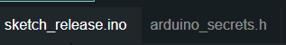
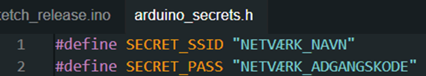

# Opsætningsguide

---

#### Dashboard:

###### LISTE AF HARDWARE:

-   Computer.

---

Dobbelt-klik på "Dashboard.exe". Nu starter dashboardet op.

---

#### Arduino:

###### LISTE AF HARDWARE:

-   Computer.
-   Arduino MKR WIFI 1010.
-   USB-kabel (Computer - Arduino).
-   EVT. Batteri til Arduino.

---

Inden du åbner "sketch_release.ino" op, så er det vigtigt at du har "Arduino IDE" installeret. Sørg for at det er installeret inden du fortsætter.

Når IDE'en er installeret, så kan du åbne "sketch_release.ino".
Nu burde du have to filer åbnet op (fil nr. 2 åbner automatisk op) (som vist på billedet herunder):

Nu skal du til at konfigurere din netværks indstillinger, så Arduinoen kan få internet.

Det gør du ved at gå ind på "arduino_secrets.h". Herinde vil du se tre linjer. Det er kun de to første du skal bruge. Nemlig "SECRET_SSID" og "SECRET_PASS" (som vist på billedet herunder):

Nu skal du udfylde navnet på dit netværk samt adgangskoden.

Nu er sidste trin bare at uploade ”sketch_release.ino” til din Arduino. Inden det kan uploades, så skal vi installere de biblioteker, som vi inkluderer. Det går vi ved at klikke på ikonet med bøger som symbol (som vist på billedet herunder):

Nu vil et søgefelt være til syne og du kan nu hente de biblioteker, som er nødvendige for at kunne uploade koden. Du finder navnet for hvert bibliotek udfor hvert ”#include”.
Nu kan du uploade ”sketch_release.ino” til din Arduino via. dit USB-kabel.

---
